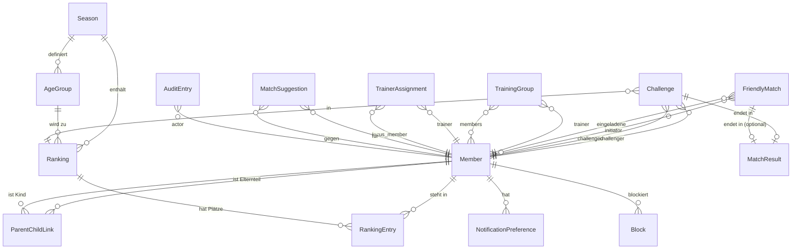
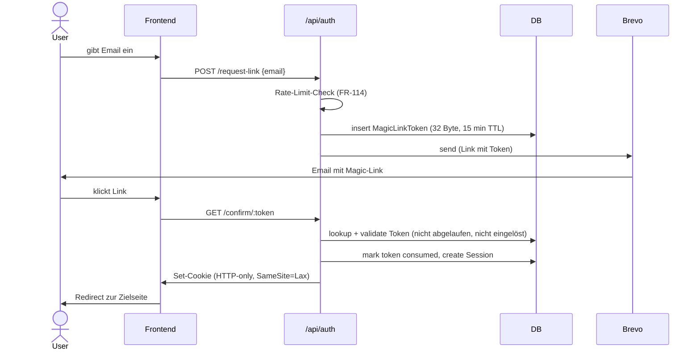

# Architektur-Übersicht

Dieses Dokument beschreibt den Modul-Schnitt, das Datenmodell, die API-Struktur,
Hintergrund-Jobs und den Auth-Flow der Plattform.

Source of Truth für die fachlichen Anforderungen bleibt
[`docs/spec/spec-v1.0.html`](../spec/spec-v1.0.html). Querverweise erfolgen über FR-IDs.

## 1. Modul-Schnitt

Die Anwendung ist als **modularer Monolith** organisiert. Jedes fachliche Modul hat
einen abgegrenzten Verantwortungsbereich. Cross-Modul-Aufrufe laufen ausschließlich
über öffentliche Service-Funktionen — direkter Repository-Zugriff auf fremde Module
ist nicht erlaubt.

| Modul            | FR-Bereich       | Verantwortung                                                                 |
|------------------|------------------|-------------------------------------------------------------------------------|
| `auth`           | NFR-2, FR-114    | Magic-Link-Tokens, Session-Lifecycle, Eltern-Bestätigungs-Links               |
| `members`        | 4.1, 4.2, 4.8    | Mitglieder-Profile, Sichtbarkeits-Stufen, Eltern-Kind-Beziehungen, Blocks     |
| `seasons`        | 4.3, 4.4         | Saison-Lifecycle, Altersgruppen-Definition, Saison-Übergangs-Strategien       |
| `rankings`       | 4.4              | Ranglisten pro Saison × Altersgruppe × Variante, Positions-Mutationen         |
| `challenges`     | 4.5              | Challenge-Lifecycle, Cooldown, Challenge-Modell (Pyramide/ELO/Hybrid)         |
| `friendlies`     | 4.6              | Freundschaftsspiele (Einzel/Doppel), offene Spiel-Suchen                      |
| `results`        | 4.7              | Ergebnis-Erfassung, Bestätigung, Streit-Lösung, Match-Modi-Validierung        |
| `suggestions`    | 4.10             | Wöchentliche Match-Vorschläge, Vorschlags-Algorithmus                         |
| `notifications`  | 4.12, 4.14       | Email-Versand, Digest-Logik, Notification-Preferences                         |
| `trainer`        | 4.9              | Trainings-Gruppen, Trainer-Zuordnungen, Aktivitäts-Übersicht                  |
| `admin`          | 4.11, NFR-6      | CSV-Import, Rollen, Konfiguration, Audit-Log                                  |
| `stats`          | 4.13             | KPI-Berechnung, Badges (rein lesend gegenüber anderen Modulen)                |

**Modul-Abhängigkeiten** (gerichtet, niemals zyklisch):

```
auth      ←  (alle UI/API-Routen via Middleware)
members   ←  fast alle Module (Mitglieder-Lookup, Sichtbarkeits-Prüfung)
seasons   ←  rankings, challenges, results
rankings  ←  challenges, results, suggestions
challenges ← results, suggestions
friendlies ← results
trainer   →  members, results (lesend), suggestions
admin     →  alle (lesend/konfigurierend)
stats     →  members, rankings, challenges, results, friendlies (alles lesend)
notifications ← alle Module (Event-Sender, kein Rück-Aufruf)
```

Genaue Modul-Regeln und Begründung folgen in **ADR-005 Modul-Schnitt**.

## 2. Datenmodell-Übersicht

Etwa 15 Haupt-Entities (siehe Spec § 6). Die folgende Übersicht zeigt nur die
wichtigsten Beziehungen — Detail-Modellierung erfolgt im jeweiligen Feature-Doc.



### Entity-Zuständigkeit pro Modul

| Modul           | Owns                                                        |
|-----------------|-------------------------------------------------------------|
| `auth`          | Session, MagicLinkToken                                     |
| `members`       | Member, ParentChildLink, Block, NotificationPreference      |
| `seasons`       | Season, AgeGroup                                            |
| `rankings`      | Ranking, RankingEntry                                       |
| `challenges`    | Challenge                                                   |
| `friendlies`    | FriendlyMatch                                               |
| `results`       | MatchResult                                                 |
| `suggestions`   | MatchSuggestion                                             |
| `trainer`       | TrainingGroup, TrainerAssignment                            |
| `admin`         | AuditEntry                                                  |

### Branded-Type-Konvention

Alle Entity-IDs werden als TypeScript-Branded-Types geführt — `MemberId`,
`SeasonId`, `RankingId` usw. — um Verwechslungen zur Compile-Zeit auszuschließen.

## 3. API-Bereiche

Jedes Modul exponiert eine Endpoint-Gruppe unter `/api/<modul>/`. RESTful für
Standard-CRUD, RPC-style für Aktionen (`/accept`, `/decline`, `/confirm`).

### Auth (`/api/auth`)
- `POST /request-link` — Magic-Link anfordern (FR-114: 3/Stunde/Email)
- `GET  /confirm/:token` — Token einlösen, Session erzeugen
- `POST /logout`
- `GET  /session` — aktuelle Session abfragen

### Members (`/api/members`)
- `GET    /` — Liste, mit Filtern (Altersgruppe, aktiv, Suche)
- `GET    /:id` — Profil (Sichtbarkeits-Stufen werden serverseitig gefiltert)
- `PATCH  /:id` — Profil ändern (eigenes oder Kind-Profil)
- `POST   /:id/pause` — selbst pausieren (FR-4)
- `POST   /:id/resume`
- `POST   /:id/block/:targetId` — Blockierung (FR-116)
- `DELETE /:id/block/:targetId`
- `GET    /:id/notification-preferences`
- `PATCH  /:id/notification-preferences`

### Seasons (`/api/seasons`)
- `GET   /` — Saisons-Liste mit Status
- `GET   /:id` — Saison-Details inkl. Altersgruppen und Regelwerk
- `POST  /` *(admin)* — Saison anlegen
- `PATCH /:id` *(admin, nur im Status PLANNED)*
- `POST  /:id/start` *(admin)* — Lifecycle PLANNED → ACTIVE, friert Regeln ein (FR-15c)
- `POST  /:id/close` *(admin)*
- `POST  /:id/archive` *(admin)*

### Rankings (`/api/rankings`)
- `GET /` — Ranglisten-Liste, gefiltert nach Saison/Altersgruppe/Variante
- `GET /:id` — Eine Rangliste mit Einträgen

### Challenges (`/api/challenges`)
- `POST /` — Challenge erstellen (Ziel-Spieler + Rangliste)
- `GET  /` — eigene Challenges (in- und outgoing)
- `GET  /:id`
- `POST /:id/accept`
- `POST /:id/decline` — mit Grund (FR-23)
- `POST /:id/propose-ranking` — Gegen-Vorschlag andere Rangliste (FR-20a-i)

### Friendlies (`/api/friendlies`)
- `POST /` — Einladung an 1 (Einzel) oder 3 (Doppel) Spieler
- `POST /open-search` — offene Suche posten (FR-95)
- `GET  /open-searches` — Liste offener Suchen mit Filter
- `POST /:id/accept`
- `POST /:id/decline`
- `DELETE /:id` — Initiator widerruft

### Results (`/api/results`)
- `POST /:matchId/report` — Sieger meldet (FR-30)
- `POST /:matchId/confirm` — Verlierer bestätigt (FR-31)
- `POST /:matchId/dispute` — Widerspruch (FR-32) — geht an Trainer/Admin
- `POST /:matchId/walkover` — Nicht-Erscheinen (FR-34)
- `POST /:matchId/resolve` *(trainer/admin)* — Streitfall-Entscheidung (FR-32, FR-54)
- `PATCH /:matchId` *(admin)* — Korrektur, erzeugt AuditEntry (FR-35)

### Suggestions (`/api/suggestions`)
- `GET  /` — eigene Vorschläge der Woche
- `POST /:id/dismiss`
- `POST /:id/convert-to-challenge` — One-Click zur Challenge (FR-104)
- `POST /:id/convert-to-friendly`

### Trainer (`/api/trainer`)
- `GET  /groups` — eigene Trainings-Gruppen
- `POST /focus/:memberId` — Fokus-Spieler markieren (FR-50a)
- `GET  /dashboard` — Aktivitäts-Übersicht aller Spieler (FR-50c)
- `POST /recommend` — Match-Empfehlung versenden (FR-53)

### Admin (`/api/admin`)
- `POST /members/import-csv` — Initial-Import (FR-60)
- `POST /members/:id/role` — Rolle zuweisen (FR-62)
- `POST /members/:id/lk-correct` — LK korrigieren (FR-2c)
- `GET  /audit` — Audit-Log
- `GET  /config` / `PATCH /config` — Saison-übergreifende Defaults

### Stats (`/api/stats`)
- `GET /members/:id/kpis` — KPIs für ein Profil (FR-120)
- `GET /members/:id/badges` (FR-122)

## 4. Cross-Modul-Schnittstellen

Die folgenden Service-Aufrufe sind die *einzig* zulässigen Wege über Modul-Grenzen.
Alle Cross-Modul-Aufrufe sind synchron — kein Event-Bus in v1.

| Aufrufer        | Aufgerufen      | Zweck                                                              |
|-----------------|-----------------|--------------------------------------------------------------------|
| `challenges`    | `members`       | Active-Status, Block-Prüfung, Match-Präferenzen                   |
| `challenges`    | `rankings`      | Gemeinsame Ranglisten ermitteln, Sprung-Regel validieren           |
| `challenges`    | `seasons`       | Aktuelle Saison-Regeln (Cooldown, Annahmefrist, Modell)            |
| `friendlies`    | `members`       | Active-Status, Block-Prüfung, Spielarten-Präferenz                |
| `results`       | `challenges`    | Challenge-Status auf COMPLETED setzen                              |
| `results`       | `rankings`      | Positions-Mutation nach Bestätigung (FR-33)                        |
| `results`       | `notifications` | Ergebnis-Bestätigung an Loser, Trainer bei Streit                  |
| `suggestions`   | `members`       | Aktive Spieler in passender LK-Range, Präferenzen                  |
| `suggestions`   | `rankings`      | Plätze für „neue Paarungen bevorzugt"                              |
| `suggestions`   | `challenges`    | Cooldown-Prüfung                                                   |
| `trainer`       | `members`       | Gruppen-Mitglieder, Fokus-Spieler                                  |
| `trainer`       | `results`       | Streitfälle anzeigen, lösen                                        |
| `admin`         | alle            | Konfiguration und Korrekturen mit Audit-Eintrag                    |
| `notifications` | `members`       | Notification-Preferences, Email-Adresse, Eltern-Routing für <14    |
| alle Module     | `auth`          | Session-Subject (Middleware liefert `useUserSession()`)            |

Cross-Modul-DB-Joins sind erlaubt, wenn fachlich sinnvoll (z. B.
`rankings × members` für eine Listen-Ansicht). Schreibende Operationen
gehen immer nur über den Service des besitzenden Moduls.

## 5. Hintergrund-Jobs

Cron-Jobs laufen serverseitig im Nuxt-Prozess via [`nitro-cron`] oder einer
einfachen `setInterval`-basierten Scheduler-Lösung (Entscheidung in der
Implementierung). Jeder Job ist idempotent — Wiederholungen sind unschädlich.

| Job                          | Frequenz       | Modul          | FR-IDs           | Zweck                                                              |
|------------------------------|----------------|----------------|------------------|--------------------------------------------------------------------|
| `expire-challenges`          | stündlich      | `challenges`   | FR-24, FR-25     | PROPOSED → EXPIRED nach 7 Tagen ohne Reaktion, ACCEPTED → analog   |
| `auto-pause-members`         | täglich        | `members`      | FR-25b, FR-25d   | Spieler ohne Match in N Wochen pausieren, später ans Ende sortieren|
| `pause-reminder`             | täglich        | `notifications`| FR-25f           | Reminder 2 Wochen vor Auto-Pause                                   |
| `weekly-suggestions`         | wöchentlich    | `suggestions`  | FR-100, FR-101   | Match-Vorschläge berechnen und im Dashboard hinterlegen            |
| `digest-flush`               | stündlich      | `notifications`| FR-115           | Aufgestaute Digest-Mails versenden                                 |
| `season-transition-prepare`  | manuell        | `seasons`      | FR-15, FR-15a    | Folge-Saison aus Endplatzierung der Vorgänger-Saison anlegen       |

`season-transition-prepare` ist kein Cron, sondern ein admin-getriggerter Job —
hier aufgeführt, weil er das gleiche Job-Pattern verwendet.

## 6. Auth-Flow

### 6.1 Magic-Link-Login



**Wichtig:**
- Token ist Single-Use und kurzlebig (Default 15 min)
- Token wird mit 32+ Byte Entropie generiert (`crypto.randomBytes`)
- Bei unbekannter Email-Adresse trotzdem 200-Response zurückgeben (kein
  User-Enumeration) — Email wird einfach nicht versendet
- Session-Cookie ist HTTP-only, sodass JavaScript ihn nicht lesen kann (XSS-Schutz)

### 6.2 Session

`nuxt-auth-utils` verwaltet das Session-Cookie. Eine zentrale Server-Middleware
prüft bei jedem `/api/*`-Request, ob eine gültige Session vorliegt — Ausnahme
sind die `/api/auth/*`-Routen.

Session-Inhalt: `{ memberId, roles: [Role], parentOf: MemberId[] }` — wobei
`parentOf` die `ParentChildLink`-Einträge des Mitglieds sind, damit Zugriffs-
Prüfungen auf Kinder-Daten ohne zusätzlichen DB-Hit funktionieren.

### 6.3 Eltern-Kind-Zugriff

Spieler unter 14 haben keinen eigenen Account (FR-40). Stattdessen verwaltet ein
Eltern-Account das Kind-Profil:

- Eltern-Login per normalem Magic-Link
- Im Frontend wählt der Eltern-User aus, welches Kind er gerade verwaltet
  (Account-Switcher), das Kind-Profil wird im Session-Cookie als „aktiver Kontext"
  vermerkt
- Server-seitig prüft die Middleware, ob `session.parentOf` den Kind-`memberId`
  enthält — sonst 403
- Trainer können Match-Ergebnisse stellvertretend melden (FR-40c) — die Bestätigung
  geht dann per separatem Magic-Link an die Eltern (One-Click-Confirm)

### 6.4 Rollen

Rollen sind nicht exklusiv (Spec § 2). Ein Mitglied kann gleichzeitig Spieler,
Trainer und Admin sein. Speicherung als String-Array auf dem `Member`-Eintrag.
Prüfung über Helper-Funktionen `requireRole('admin')`, `requireRole('trainer')`.

## 7. Offene Punkte für die folgenden ADRs

Aus dieser Übersicht ergeben sich konkrete Entscheidungen, die in eigenen ADRs
festgehalten werden müssen:

- **ADR-005 Modul-Schnitt** — formale Festlegung, ob `stats` ein eigenes Modul ist
  oder als „Read-Model" in `members` aufgeht; Konvention für Service-Funktions-
  Signaturen
- **ADR-006 Challenge-Modell-Strategie** — wie die Pyramide/ELO/Hybrid-Abstraktion
  konkret aussieht (Interface, austauschbare Implementierungen); welches Modell
  v1 als Default mitliefert
- **ADR-007 Job-Scheduler** — `nitro-cron` vs. einfacher `setInterval`-Scheduler
  vs. externer Trigger (Hetzner Cron + HTTP-Call); Lock-Konzept gegen
  Doppel-Ausführung
- **ADR-008 Email-Versand-Abstraktion** — direkter Brevo-Aufruf vs. Abstraktion für
  späteren Anbieter-Wechsel; Behandlung von Bounces und Beschwerden

## 8. Bewusste Auslassungen

Was diese Übersicht **nicht** klärt und auch nicht klären soll:

- Konkrete Drizzle-Schemata (entstehen in den Feature-Docs)
- UI-Komponenten-Hierarchie (entsteht beim Bauen)
- Detaillierte Validierungs-Regeln (Zod-Schemas pro Feature)
- Performance-Optimierungen (kommen, wenn messbar nötig — siehe CLAUDE.md)
